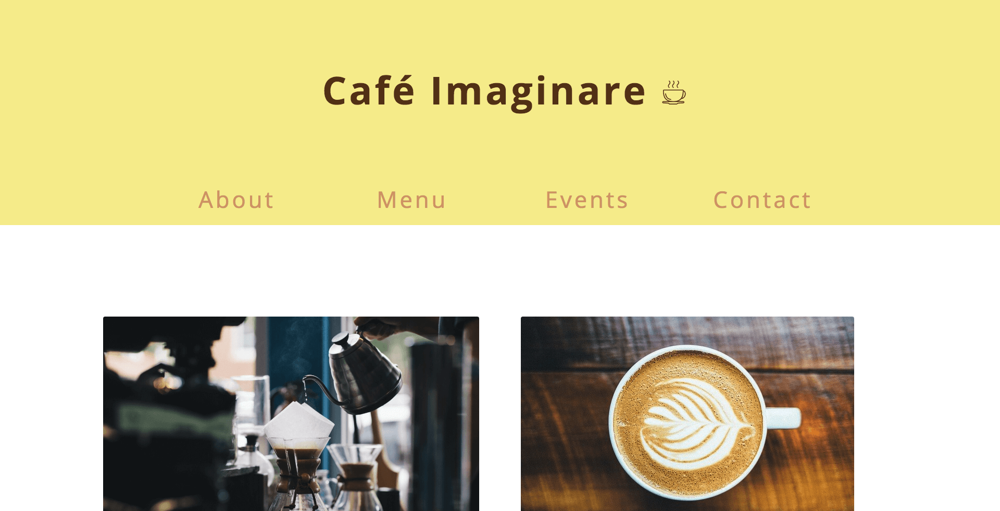
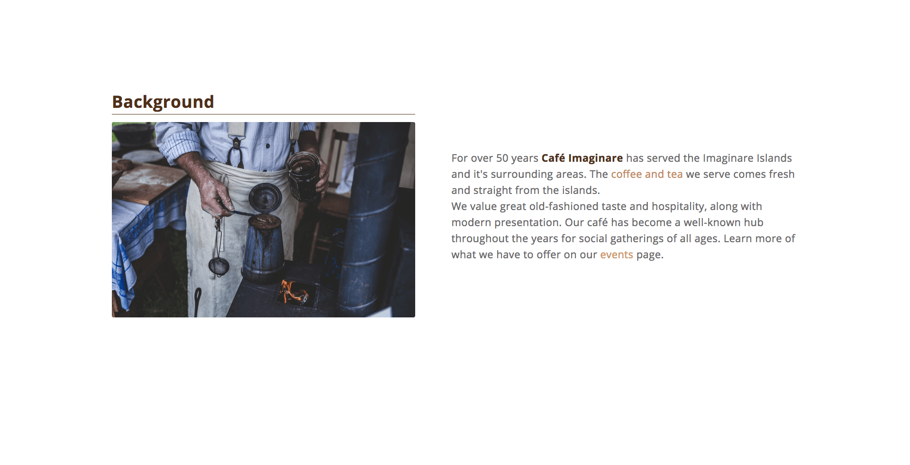
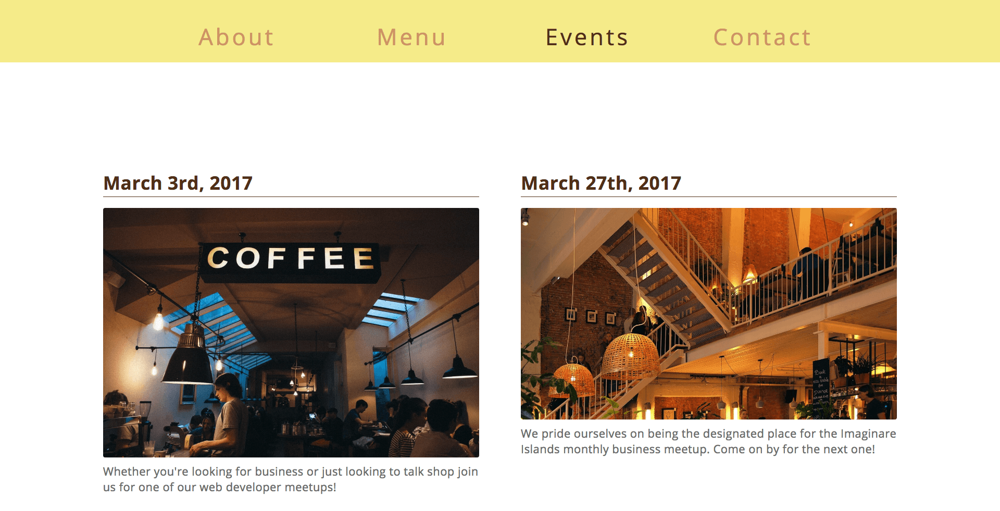
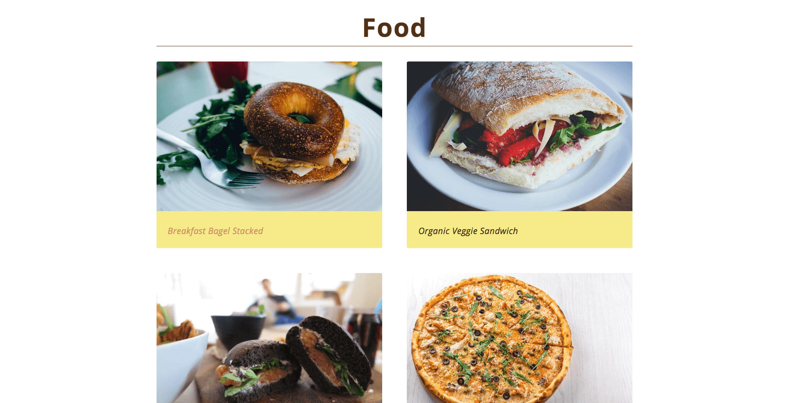
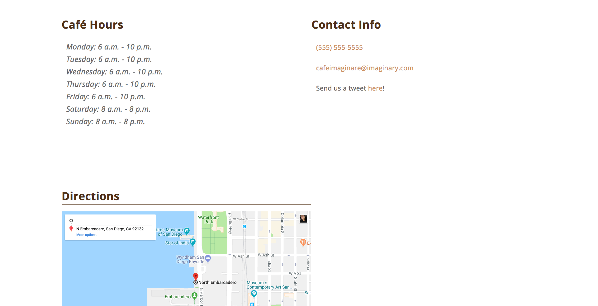

# Café imaginare

**Live App** : [https://terrancecorley.com/cafe-imaginare](https://terrancecorley.com/cafe-imaginare)

## Summary  

Café Imaginare is like the word imaginare, fictional. This is a mock static website and was created with the intention to present to small business owners as a potential client site. 

## Screenshots

### Site Header

### About Page
  

### Events Page
  

### Food Gallery

### Contact Page

## Tech Stack  

Café Imaginare was created with the following technologies:

**Client**: CSS3, HTML5

**Deployment**: GitHub Pages
